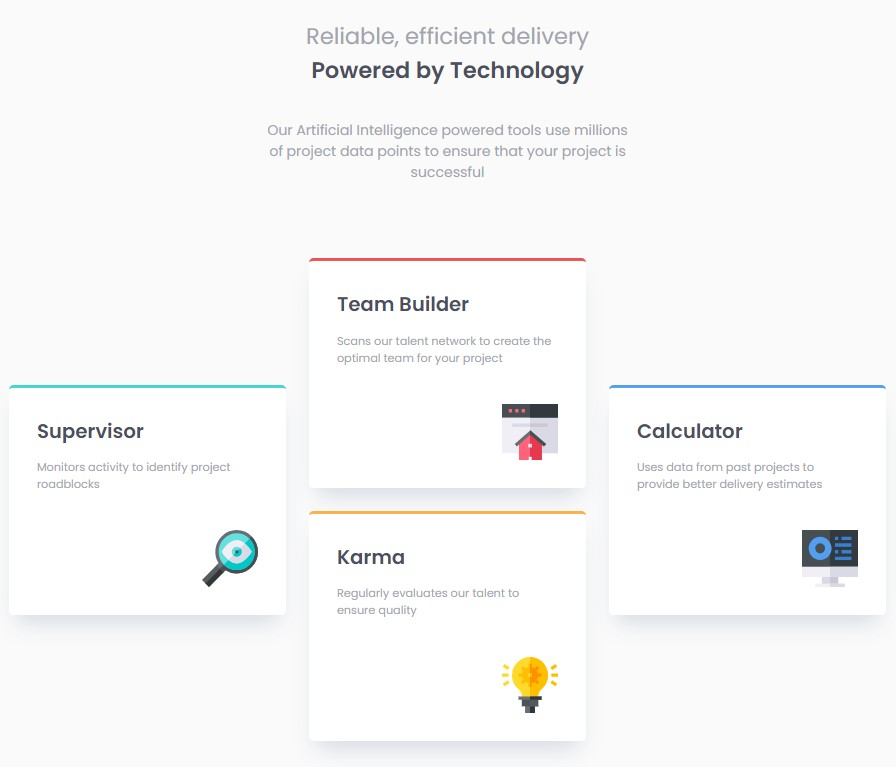

# Frontend Mentor - Four card feature section solution

This is a solution to the [Four card feature section challenge on Frontend Mentor](https://www.frontendmentor.io/challenges/four-card-feature-section-weK1eFYK).

## Table of contents

- [Overview](#overview)
  - [Screenshot](#screenshot)
  - [Links](#links)
- [My process](#my-process)
  - [Built with](#built-with)
  - [What I learned](#what-i-learned)
- [Author](#author)

## Overview

### The challenge

### Screenshot

### Links

- Solution URL: [Github](https://github.com/Muhammad-Taus/Front-End-Mentor-Four-Card-Feature-Selection)
- Live Site URL: [Live site URL](https://mt-fem-four-card-feature-selection.netlify.app/)

## My process

### Built with

- Semantic HTML5 markup
- CSS custom properties
- CSS Grid
- Mobile-first workflow
- Responsive design for mobile, tablet, desktop

### What I learned

I implemented grid for creating responsive design of the layout. Though the challenge was for mobile & desktop versions, I also implemented responsiveness for tablet devices. Used custom css properties for creating elegant looking card boxes.

## Author

- Frontend Mentor - [@Muhammad-Taus](https://www.frontendmentor.io/profile/Muhammad-Taus)
